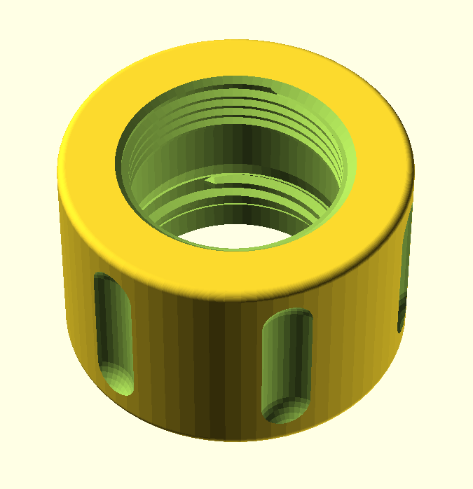

# Nestout 15000mAh — Weatherproof Cable Passthrough Cap

A 3D-printed replacement cap for the Nestout 15000mAh battery bank that integrates a McMaster-Carr cable gland, allowing a USB cable to pass into the sealed battery while maintaining water resistance.



## Parts

| Part | Source | Qty |
|------|--------|-----|
| [Nestout 15000mAh battery](https://nestout.com/products/outdoor-portable-battery-15000mah) | — | 1 |
| [McMaster 5302N121 cord grip](https://www.mcmaster.com/5302N121/) | mcmaster.com | 1 |
| 3D-printed adapter cap | This repo | 1 |
| Self-fusing silicone tape | Amazon / hardware store | 1 roll |

## How It Works

The cap is a thread adapter with two sets of internal threads:

- **Bottom:** Nestout proprietary threads (25.5mm major diameter, 2.2mm pitch, trapezoidal) mate with the battery body's male threads. The battery's O-ring seals against the cap's smooth bore below the threads.
- **Top:** Standard M25x1.5 threads accept the McMaster 5302N121 gland shaft directly. The gland's hex body sits on the cap's top face.

The cable passes through the gland, through the cap bore, and down into the battery's port well. The bore is wide enough for a USB cable to route with a gentle bend to reach the port. Use a right-angle USB adapter if needed.

### Cross-Section

```
                    ┌─ Compression cap
                    │  ┌─ Split rubber bung (around cable)
                    │  │
            ╔═══════╧══╧═══════╗
            ║   Gland hex body ║ ← Sits on cap top surface
            ╠═══════╤═══╤══════╣
            ║  M25×1.5 threads ║ ← 8mm deep
    ┌───────╫───────┤   ├──────╫───────┐
    │       ║  Shaft clearance ║       │  3D-printed
    │       ╠───────┤   ├──────╣       │  adapter cap
    │       ║  Nestout threads ║       │  (PETG)
    │       ║  (~2 turns)      ║       │
    │       ╠───────┤   ├──────╣       │
    │       ║  Smooth bore     ║       │
    │       ║  (O-ring zone)   ║       │
    └───────╫───────┤   ├──────╫───────┘
            ║  ●═O-ring═●      ║ ← Lives on battery body
            ╠═══════╧═══╧══════╣
            ║   Battery body   ║
            ║   (USB ports)    ║
            ╚══════════════════╝
```

### Sealing

1. **Battery to cap:** The O-ring on the battery body presses against the cap's smooth internal bore — same principle as the stock cap.
2. **Cap to gland:** M25 threads provide mechanical retention. Wrap 2-3 turns of PTFE tape on the gland shaft threads before installing for a watertight seal.
3. **Gland to cable:** The cord grip's split rubber bung and compression cap handle this (IP68-rated). The 5302N121 fits 5.3-8.5mm cable OD. Most USB cables are 4-4.5mm — wrap a few layers of self-fusing silicone tape around the cable at the seal point to build up the diameter.
4. **USB plug:** Apply dielectric grease to the USB connector before plugging in. This displaces moisture from the contacts and prevents corrosion if any water does get inside.

## Printing

### Requirements

- [OpenSCAD](https://openscad.org/)
- [BOSL2 library](https://github.com/BelfrySCAD/BOSL2) — install via OpenSCAD's Library Manager

### Settings

| Setting | Value |
|---------|-------|
| Material | PETG or ASA (not PLA) |
| Layer height | 0.12-0.15mm |
| Infill | 100% |
| Walls/perimeters | 4+ |
| Orientation | Threaded end down on build plate |
| Supports | None |

PLA is too brittle for coarse threads with only ~2 turns of engagement, and softens in heat (a black battery in direct sun easily exceeds 60C).

### Tuning

If the cap is too tight on the battery, increase `nestout_slop` (try 0.25-0.30). If too loose, decrease it (try 0.15). Same idea for `m25_slop` and the gland fit.

## Dimensions

| Parameter | Value |
|-----------|-------|
| Cap outer diameter | 40mm |
| Cap total height | ~26mm |
| Nestout thread major dia. | 25.5mm |
| Nestout pitch | 2.2mm |
| Smooth bore ID | 25.9mm |
| Battery engagement depth | 10mm |
| M25 thread depth | 8mm |

## License

This project is provided as-is with no warranty. Use at your own risk.
